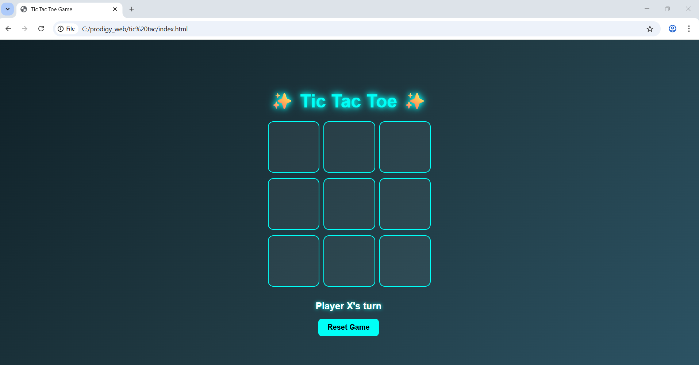
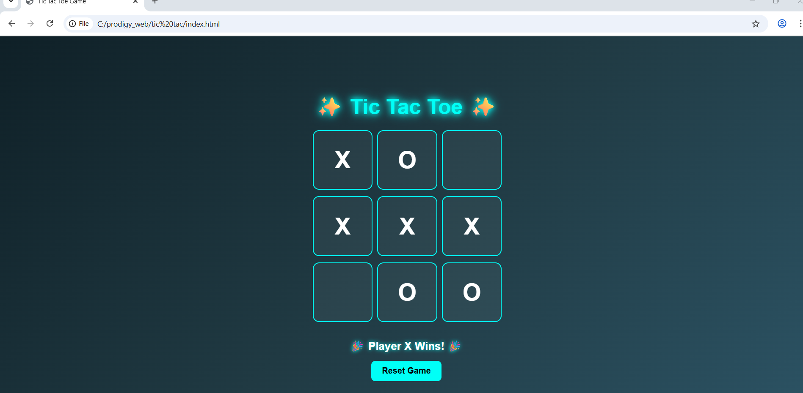

# ❌⭕ PRODIGY_WD_03 – Tic-Tac-Toe Web Application

👉 “An interactive Tic-Tac-Toe web application built with HTML, CSS, and JavaScript featuring player turns, win/draw detection, and responsive design.”

---

## 📌 Project Description
This project is **Task‑03** of my Web Development Internship at **Prodigy InfoTech**.  
It’s a **Tic-Tac-Toe Game** where users can play against each other. The game:
- Handles player clicks
- Tracks game state
- Checks for winning conditions
- Declares winner or draw

---

## 🎨 Features
- ✅ Two-player mode (X and O)
- ⚡ Interactive and responsive design
- 🎮 Turn-based gameplay
- 🏆 Win/draw detection
- 🔄 Reset/Restart game functionality
- 💻 Clean and simple UI

---

## 📂 Project Structure

PRODIGY_WD_03/

│── index.html 
│── style.css 
│── script.js 
│── gameboard.png 
│── win.png 
└── README.md 

## 🖼️ Screenshots
### Game Board  

### Win Notification  

